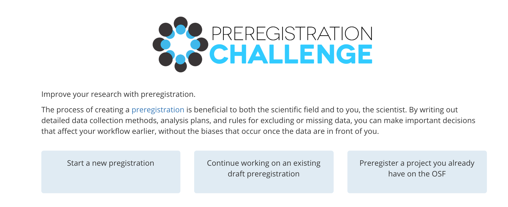
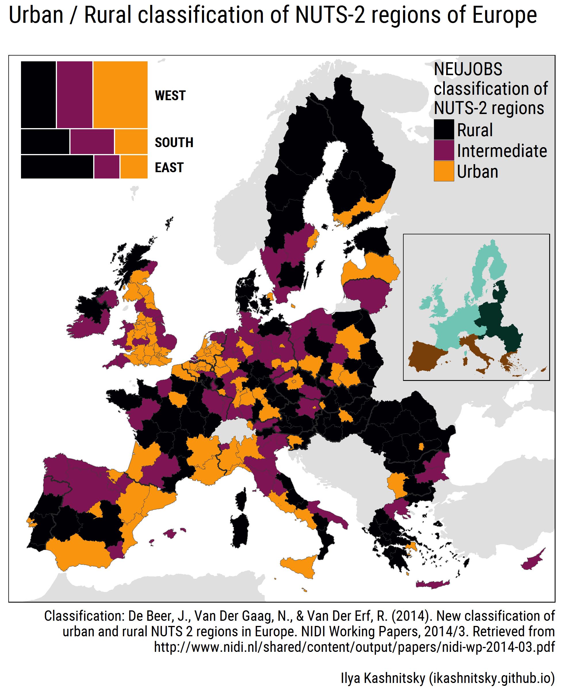
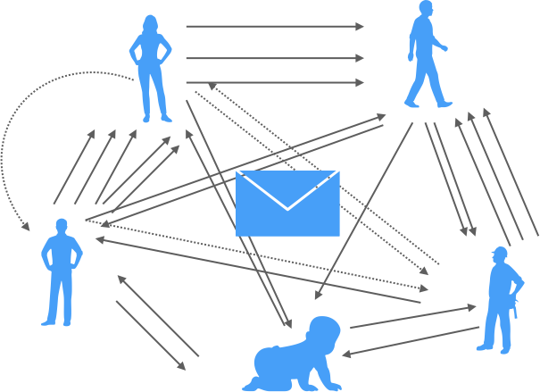
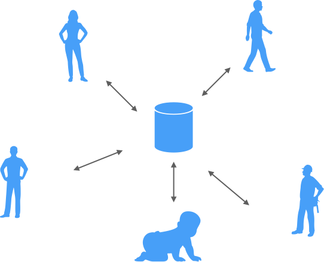

```{r knitr-setup, echo = FALSE,}
knitr::opts_chunk$set(echo = FALSE,
                      out.width = "70%",
                      fig.align = "center",
                      message = FALSE,
                      fig.asp = .618,
                      cache = TRUE)

```


```{r load-libs}
library(tidyverse)
library(mosaic)
library(plotly)
```


# Schritt 1: Thema finden

## Man kann nicht alle Papers lesen


```{r sci-growth, echo = FALSE, fig.align = "center"}

year <- seq(from = 1980, to = 2018)

lit_growth <- function(x){
  702.880 * 2.718282^(0.029*(x-1980))
}

npubs <- lit_growth(year)

p_growth <- ggplot(data.frame(year, npubs), aes(x = year, y = npubs)) +
  geom_line() +
  labs(x = "Jahr",
       y = "Anz. von Publikationen [in 1000]",
       title = "ca. 8% Wachstum p.a.; Verdopplungszeit: 9 Jahre")

p_growth

```

<small>
@bornmann2015growth;@Larsen:2010aa
</small>


<!-- Die Literaturmenge verdoppelt sich alle 9 Jahre -->


##  {data-background="img/50bil.jpg"}


<small>
@LEAP:LEAP0509; Bildquelle: ZeroOne; CC-BY-SA 2.0; https://www.flickr.com/photos/70591690@N00/2693551009/
</small>


## Lesen Sie (nur) zu Ihrem Steckenpferd


```{r scho-ex, echo = FALSE, out.width = "100%"}

knitr::include_graphics("https://media.giphy.com/media/3oFzlYqs3jaI90KaL6/giphy.gif")

```


Google Scholar ist eine nützliche Suchmaschine. 


## Nutzen Sie eine Software zur Literaturverwaltung

- [Mendeley](https://www.mendeley.com/)
- [Bibdesk](https://bibdesk.sourceforge.io/) nur Mac
- [JabRef](http://www.jabref.org/)


Es gibt [mehr Zitierstile](https://www.zotero.org/styles) als es Journals gibt...


##  {data-background="img/plos-cite.png"}

<!-- Journals lieben es, die Zitationsinfo zu verstecken  -->

## {data-background="img/twitter_ex.png"}

<!-- Verfolge (die Publikationen von) interessanten Forschern (m/w)  -->


## Soziale Medien für Wissenschaftler

- [Blogs](https://data-se.netlify.com/)
- [Twitter](https://twitter.com/)
- [Researchgate](https://www.researchgate.net/)
- [Medium](https://medium.com/)
- [Facebook](hptts://facebook.com/)


##  {data-background="img/stabi.png"}

<!-- Große Unis bieten Zugang zu vielen Papers -->

<!-- ## Lesen Sie nach dem Pryamidenprinzip -->

<!-- - Titel -->
<!-- - Absctract -->
<!-- - Überschriften -->
<!-- - Diagramme -->
<!-- - Informationsdichte Abschnitte -->


## Beispiel für das Pyramiden-Lesen


<small>
Cosmetics as a Feature of the Extended Human Phenotype: Modulation of the Perception of Biologically Important Facial Signals [@Etcoff2011]

https://goo.gl/GwsKnN
</small>

```{r makeup, echo = FALSE, out.width = "50%"}


```


## Suchen Sie Journals von interessanten Papers

```{r sjr, echo = FALSE}

knitr::include_graphics("img/sjr.png")

```

<small>
http://www.scimagojr.com/journalrank.php
</small>


## Trauen Sie keinem Impact Factor 


Wenig Zusammenhang zwischen IF und statistischer Power

<small>
@Brembs2013, Abbildung 2, CC-BY
</small>

## Der Impact Factor sagt wenig über einzelne Papers aus

```{r cit-distrib, echo = FALSE}

knitr::include_graphics("img/cit_distrib-crop.png")

```

Nature: IF = 38.1, 75% der Artikel unterhalb des IF  
Science: IF = 34.7, 76% der Artikel unterhalb des IF  
PLOS ONE: IF = 3.1, 72% der Artikel unterhalb des IF  


<small>
@lariviere2016simple
</small>


## Zielen Sie auf Journals mit hohem Impact Factor


```{r if-reject, echo = FALSE, out.width = "70%"}


```

<small>
https://blog.frontiersin.org/2015/12/21/4782/ 
</small>


# Schritt 2: Studie planen

## Kochen Sie eine Studie nach

*Procedure*

Subjects were presented the stimuli on an iMac desktop. Each subject saw all four looks for each of the 25 models in a randomized sequence and rated them for attractiveness, likeability, trustworthiness, and competence using a 7-point "slider scale" ranging from end points labeled "not at all" to "highly/ extremely." [@Etcoff2011, p.4]


## Melden Sie Ihre Studie an





<!-- ## Verringern Sie die Researcher Degrees of Freedom -->


## Zufallsbefunde

```{r echo = FALSE}
m1 <-rnorm(n = 1000, mean = 0, sd = 1)
m2 <-rnorm(n = 1000, mean = 0, sd = 1)

df <- data_frame(
  m1 = m1,
  m2 = m2,
  diff = m1 - m2,
  sig = ifelse(abs(diff) > 1.96, "sig", "ns")
)

p_zufall <- ggplot(df) +
  aes(x = diff, fill = sig) +
  geom_histogram() +
  geom_vline(xintercept = c(-1.96, 1.96), linetype = "dashed")

p_zufall
```


## Optional stopping erzeugt Zufallsbefunde

```{r simu-phacking, echo = FALSE}
df <- data_frame(
  ID = 10:100
)

set.seed(42)
df %>% 
  mutate(value_vec = ID %>%  map(~rnorm(n = ., mean = 0, sd = 1))) -> df

df$value_vec %>% 
  map(~t.test(., mu = 0)) %>% 
  map("p.value") %>% 
  simplify -> p_values

df %>%
  mutate(p_values = as.numeric(p_values),
         sig = ifelse(p_values < .05, "sig", "ns")) -> df

df %>% 
  filter(between(ID, 10, 60)) %>% 
  ggplot() + 
  aes(x = ID, y = p_values, color = sig) +
  geom_point() +
  geom_line(color = "grey20") +
  geom_hline(yintercept = .05, color = "red", linetype = "dashed") -> p_simu_phacking
  

p_simu_phacking
```


## Richtlinien für mehr Objektivität

1. Stichprobengröße vorab festlegen
2. Auf ausreichende Power achten (cell size > 20)
3. Alle Variablen vorab festlegen
4. Studienablauf vorab festlegen

<small>
@Simmons2011c, [Volltext hier](http://journals.sagepub.com/doi/abs/10.1177/0956797611417632?url_ver=Z39.88-2003&rfr_id=ori:rid:crossref.org&rfr_dat=cr_pub%3dpubmed)

@Wicherts:2016aa, [Volltext hier](https://www.frontiersin.org/articles/10.3389/fpsyg.2016.01832/full)

</small>

## Berechnen Sie Power oder Präzision vorab

```{r pwr, echo = TRUE}
library(pwr)
pwr.t.test(n = 30, d = .3)
```


## Effektstärken in der freine Wildbahn sind klein

- klein (25. Perzentil): $\rho = 0.1$
- mittel (50 Perzentil): $\rho = 0.2$
- groß (75. Perzentil): $\rho = 0.3$


<small>
@gignac2016effect
</small>

## Denken Sie an Datenschutz und sonstige Ethikbelange

>   Wenn Daten vollständig anonymisiert sind, z.B. Fragebogendaten oder Daten aus Experimentalreihen, muss eine entsprechende Einwilligung nicht notwendigerweise eingeholt werden, da keine individuellen Zuordnungen mehr möglich sind. In begründeten Zweifelsfällen sollte die lokale Ethikkommission bzw. die Ethikkommission der DGPs konsultiert werden


<small>
@Schonbrodt:2016aa
</small>

## Arbeiten Sie mit Kollegen und Studierenden zusammen


<small>
https://xkcd.com/755/ 
</small>


# Schritt 3: Daten auswerten

## Mit Excel sind Fehler schwer zu finden


@herndon2013does

## Das Problem ist, dass Excel Daten und Analyse vermengt


## Nutzen Sie Syntaxsprachen wie R

Auf Deutsch:
```{r r-ex, eval = FALSE, echo = TRUE}

meine_rohdaten %>% 
  lies_sie_ein() %>% 
  entferne_fehlende_Werte() %>% 
  gruppiere_nach(geschlecht) %>% 
  berechne_mittelwerte() -> meine_daten
```

Auf Errisch:

```{r r-ex2, eval = FALSE, echo = TRUE}

my_rawdata %>% 
  read_csv() %>% 
  drop_na() %>% 
  group_by(sex) %>% 
  summarise(umsatz_mw = mean(umsatz_produkte)) -> my_data
```


## Rücken Sie Diagramme ins Zentrum Ihrer Analyse


```{r p-circ, echo = FALSE, out.width = "50%"}

knitr::include_graphics("img/circlize.png")

```

<small>
http://zuguang.de/circlize/
</small>

## Rücken Sie Diagramme ins Zentrum Ihrer Analyse 2

```{r p-nuts, echo = FALSE, out.width = "50%"}



```


## Lesen Sie ein gutes R-Buch 

... oder holen Sie einen Statistiker an Bord


Bald erhältlich: Sauer, S. Modernde Datenanalyse mit R. Springer.


# Schritt 4: Manuskript schreiben


## Halten Sie sich an den Standard-Aufbau 

1. Title page
2. Abstract
3. Introduction
4. Method
5. Results
6. Discussion
7. References
8. Appendices
9. Tables
10. Figures


## Schreiben Sie im Häusle-Bauer-Stil

| Häusle-Bauer    | Paper-Schreiber |
|-----------------|-----------------|
| Entwurf         | Notizen |
| Plan            | Gliederung |
| Rohbau          | Stichpunkte |
| Innenausbau     | Ausformulieren |
| Verputzen       | Formatieren |
| Einziehen!      | Einreichen! |


## {data-background="img/scribble.jpg"}


## Schicken Sie das Manuskript NICHT per MAil



## Nutzen Sie eine gemeinsame Datei-Ablage




## Löschen Sie Word

- https://www.authorea.com/
- http://rmarkdown.rstudio.com/index.html

Für die Word-Afficionados: [APA Word-Vorlage](https://templates.office.com/en-us/APA-style-report-6th-edition-TM03982351?ui=en-US&rs=en-US&ad=US)


## Rmarkdown


<iframe src="https://player.vimeo.com/video/178485416" width="700" height="394" frameborder="0" style="margin-bottom: 2em;" webkitallowfullscreen mozallowfullscreen allowfullscreen>
</iframe>


## Lernen Sie `git`

<a href="https://imgflip.com/i/23adrx"></a>

<small>
https://imgflip.com/i/23adrx
Tutorial: https://osf.io/v9nc6/
</small>


## Titel: prägnant und ansprechend


- "You probably think this paper's about you: narcissists' perceptions of their personality and reputation."

<!-- - "Children and mini-magnets: an almost fatal attraction." -->
<!-- - "College Admissions and the Stability of Marriage" -->
- "Pressures produced when penguins pooh — calculations on avian defaecation."

- "The tooth, the whole tooth and nothing but the tooth: how belief in the Tooth Fairy can engender false memories."
<!-- - "One giant leap for mankind? A cost-utility analysis of abolishing the law of gravity." -->
  
  
## Der Abstract ist das Aushängeschild

```{r tweet, echo = FALSE, out.width = "70%"}

knitr::include_graphics("img/tweet.png")

```


  
  
## Markdown 

http://markdownlivepreview.com/
<!-- https://jbt.github.io/markdown-editor/  -->
<!-- https://dillinger.io/   -->
<!-- http://markdown.pioul.fr/ -->


## Template `papaja` für APA-Formatierung

```{r eval = FALSE, echo = TRUE}
devtools::install_github("crsh/papaja")
```

[RMarkdown-Datei](https://raw.githubusercontent.com/crsh/papaja/master/example/example.Rmd)

[PDF-Ausgabe](https://raw.githubusercontent.com/crsh/papaja/master/example/example.pdf)

## Schreiben Sie einen Cover Letter an den Editor


```{r gorilla, echo = FALSE, out.width = "50%"}


```
<small>
Gellinger, 2017, https://pixabay.com/de/gorilla-affe-menschenaffe-zoo-3035579/, CC0
</small>

## Beachten Sie die Aims and Scopes Ihres Journals

>    Science seeks to publish those papers that are most influential in their fields or across fields and that will significantly advance scientific understanding. Selected papers should present novel and broadly important data, syntheses, or concepts. They should merit recognition by the wider scientific community and general public provided by publication in Science, beyond that provided by specialty journals.

<small>

http://www.sciencemag.org/about/mission-and-scope 
</small>

<!-- https://www.elsevier.com/connect/7-steps-to-publishing-in-a-scientific-journal -->


## Fügen Sie die 21-Word-Lösung hinzu

>    We report how we determined our sample size, all data exclusions (if any), all manipulations, and all measures in the study.


<small>
@Simmons2012
</small>

# Schritt 5: Manuskript einreichen


 


## Erstellen Sie sich eine ORCID

https://orcid.org/

>   ORCID provides a persistent digital identifier that distinguishes you from every other researcher and, through integration in key research workflows such as manuscript and grant submission, supports automated linkages between you and your professional activities ensuring that your work is recognized. 


## Beurteilen Sie die Qualität Ihres Manuskripts

- [STROBE (Beobachtungsstudien, z.B. Korrelation)](https://www.strobe-statement.org/index.php?id=available-checklists)
- [CONSORT (Experimentelle Studien)](http://www.consort-statement.org/checklists/view/32--consort-2010/66-title)


## Laden Sie Ihren Preprint auf einen Open Access Server

```{r osf-preprint, echo = FALSE, out.width = "70%"}

knitr::include_graphics("img/osf_preprints.png")

```


## Machen Sie Ihre Daten und Ihr weiteres Material zugänglich


Beispiel: [Datensatz zu Extraversion](https://osf.io/4kgzh/)


## Nutzen Sie das Open Science Framework

```{r osf, echo = FALSE}


```


## Schreiben Sie in den sozialen Netzwerken

```{r data-se, echo = FALSE}


```


## Klären Sie, wer Autor ist

Autoren sollen vier Kriterien erfüllen:

1. Substanziell beitragen zur Entwicklung der Studie oder Datenerhebung oder Datenanalyse oder Interpretation der Ergebnisse UND
2. Das Manuskript (in Teilen) schreiben oder kritisch revidieren UND
3. Der finalen (zu publizierenden Version) explizit zustimmen UND
4. Zustimmen, für alle Aspekte der Publikation verantwortlich zu sein (hinsichtlich Integrität, Richtigkeit, Genauigkeit etc.)

Ansonsten *acknowledgement*


<small>
http://www.icmje.org/recommendations/browse/roles-and-responsibilities/defining-the-role-of-authors-and-contributors.html
</small>


## Schauen Sie Ihren h-Index nach 


<small>
H-index. (2018, January 24). In Wikipedia, The Free Encyclopedia. Retrieved 12:08, January 25, 2018, from https://en.wikipedia.org/w/index.php?title=H-index&oldid=822182293
</small>


## Erstellen Sie sich ein Scholar-Profil


## Ertragen Sie die Hinweise der Reviewer 


>  The manuscript reads much like an unrevised masters level paper. 

>  You do not use the empirical data for the analysis, but the empirical data uses you.

<!-- >  The author does not exhibit adequate acquaintance with the subject under discussion, the scholarship on it, the structure of logical argument, or the writing of English.  -->

>  This article is on an interesting topic. Unfortunately there is no more positive to say about this manuscript. 


<small>
https://shitmyreviewerssay.tumblr.com/
</small>

# Anhang


## Empfohlene Literatur

1. The Seven Deadly Sins of Psychology [@Chambers:2017aa]
2. How to be a Modern Scientist[@Leek:2016aa]
3. R für Data Science [@rfuerds]
4. Modern Datenanalyse mit R `r emo::ji("nerd_face")`


## Zitierte Literatur
<P ALIGN=LEFT>

<font size="1">
<div id="refs"></div>

</P>

