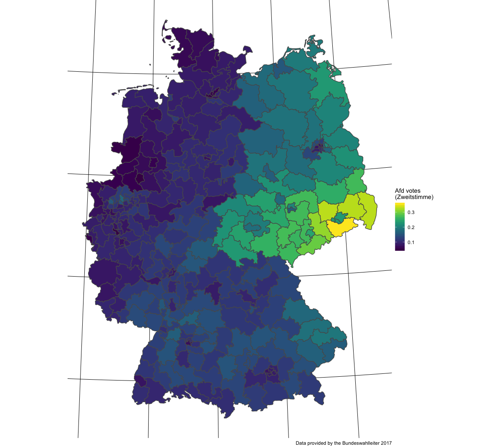

```{r setup, include=FALSE}
options(htmltools.dir.version = FALSE)

knitr::opts_chunk$set(
  comment = "#>",
  collapse = TRUE,
  message = FALSE,
  warning = FALSE,
  error = TRUE,
  cache = TRUE,
  out.width = "70%",
  fig.align = 'center',
  fig.width = 6,
  fig.asp =  0.4,  #0.618,  # 1 / phi
  fig.show = "hold",
  size = "tiny"
)
```


```{r libs, echo = FALSE}
library(tidyverse)
library(tidyr)
library(DiagrammeR)
library(rethinking)
library(knitr)
library(kableExtra)
```


class: center, middle, inverse
# Menace to society: Right-wing populism then and now

---
background-image: url(img/ww2.jpg)


class: center, middle, inverse
# To hell and back

Causes for Europe' self-destruction in the first half of the 20th century

---


class: top, left
# Nationalism as a driving force of 20th century world wars*


- **nationalism**
- authoritarianism
- racism
- territorial disputes
- class conflicts
- crisis of capitalisms


.footnote[Source: Kershaw, I. (2016). To hell and back: Europe 1914-1949. New York City, NW: Penguin.]


???

Image credit:Wikipedia, RIA Novosti archive, image #44732 / Zelma / CC-BY-SA 3.0


<!-- --- -->

<!--  -->

---


class: center, middle, inverse

# Enemies of the open society

---


class: top, left

# What is right-wing populism?


- suspicion against elites
- common sense approaches to societal problems
- narrative of "forgotton man Joe Plumber"
- anti-immigrant, nationalist
- fueling aversion in the sociecy


.footnote[Source: Decker, F. (2003). Der neue rechtspopulismus. Wiesbaden: VS Verlag für Sozialwissenschaften.]


---

# AfD as a nucleus of the German right-wing movement


- close contacts to right-wing ultras
- recruits (ex-)nazis
- Indirect support of violence towards minorities:
    - "Wenn der Staat die Bürger nicht mehr schützen kann, gehen die Menschen auf die Straße und schützen sich selber." — Tweet by Markus Frohnmaier (@Frohnmaier_AfD) on August, 26th 2018 in reaction to Chemnitz riots

.footnote[Source: Fuchs, C., & Middelhoff, P. (2018, May 12). Neue Rechte - Bis in den letzten, rechten Winkel. Retrieved from https://www.zeit.de/politik/deutschland/2018-05/neue-rechte-verteilung-deutschlandkarte]


---


class: middle, center
# Understanding (right-wing) populism processes

---

class: top, left
# Folk theories on AfD success

Populist party support is fueled by 
- weak economy ("rust belt hypothesis")
- high immigration ("flooding hypothesis")
- cultural patterns ("Saxonia hypothesis")


---

# Research model


```{r echo =FALSE}
grViz(
  "digraph research_mdoel {

 
  graph [layout = dot,
         rankdir = LR];

  node [fontname = Helvetica, fontcolor = darkslategray,
        shape = rectangle, fixedsize = true, width = 3,
        color = darkslategray]


  unemployment -> AfD
  foreigners  -> AfD
  east_west -> AfD}"
)
```


---

class: middle, center, inverse

# AfD Votes, and socioenomic factors at the Bundestagswahl 2017


---


class: top, left
# AfD votes


```{r afd-votes, fig.align="center", out.width="70%", echo=FALSE}

```

 
---


# Unemployment


```{r unemp, out.width="70%", echo=FALSE}
knitr::include_graphics("img/unemp.png")
```
 

---

# Foreigners


```{r foreigner, fig.align="center", out.width="70%", echo=FALSE}
knitr::include_graphics("img/foreigner.png")
```


---


class: middle, center, inverse

# data analysis


---


class: top, left

# Data preparation

- data were obtained from [Bundeswahlleiter 2017](https://www.bundeswahlleiter.de/bundestagswahlen/2017/ergebnisse.html)
- no missings
- data was z-transformed

---

# Bayes modeling


- Stan via the R packages `rstan` and `rethinking`
- Hamiltonian Markov Chain Monte Carlo (MCMC)
- 2000 iterations
- 2 chains
- `r emo::ji("scream_cat")` some fitting issues with count models


---

# Model specification


$$\begin{aligned}
\text{AfD}_i &\sim \mathcal{N}(\mu_i, \sigma)\\
\mu &= \alpha + \beta 0_{[east]} + \beta 1 \cdot \text{foreign_z} + \beta2 \cdot \text{unemp_z}\\
\alpha &\sim \mathcal{N}(0, 1)\\
\beta0_{[east]} &\sim  \mathcal{N}(0, 1)\\
\beta1  &\sim  \mathcal{N}(0, 1)\\
\beta2  &\sim  \mathcal{N}(0, 1)\\
\sigma &\sim \mathcal{N}(0, 1)\\
\end{aligned}$$


```{r m9-stan, eval = FALSE}
afd_model1 <- map2stan(
  alist(
    afd_prop ~ dnorm(mu, sigma),
    mu <- beta0[east] +  beta1*for_z + beta2*unemp_z,
    beta1[east] ~ dnorm(0, 10),
    beta2 ~ dnorm(0, 1),
    beta3 ~ dnorm(0, 1),
    sigma ~ dnorm(0, 1)),
  data = d)
```


---


# Model diagnosis: traceplot

```{r echo = FALSE, out.width="70%"}
knitr::include_graphics("img/m9-traceplot.png")
```

---


# Model diagnosis and coefficients

```{r m9, echo = FALSE}
load("objects/stan_normal_models.Rda")

m <- stan_normal_models[[1]]


precis(m, depth = 2)@output %>% 
  rownames_to_column() %>% 
  rename(coefficient = rowname) %>% 
  mutate_if(is.numeric, round, 2) -> precis_m
  
precis_m %>% 
kable() %>% 
  kable_styling(bootstrap_options = c("striped", "hover"))
```

---

# The whole shabeng: Multi level wins


```{r all-models, echo = FALSE}
load("objects/stan_model_comparison.Rda")

stan_model_comparison@output %>% 
  rownames_to_column() %>% 
  rename(model = rowname) %>% 
  mutate_if(is.numeric, round, 2) -> stan_model_comparison_output

tibble::tribble(
       ~model,            ~predictors,
   "m15_stan", "state+for+unemp (ML)",
   "m14_stan",  "east+for+unemp (ML)",
   "m13_stan",           "state (ML)",
   "m10_stan",       "for+unemp+east",
    "m9_stan",     "for+unemp+east[]",
   "m12_stan",            "area (ML)",
  "m11c_stan",                "unemp",
   "m16_stan",     "null (intercept)",
   "m9a_stan",            "for+unemp",
  "m11a_stan",                  "for",
  "m11d_stan",                 "east"
  ) -> model_spec

stan_model_comparison_output %>% 
  full_join(model_spec) %>% 
  select(model, predictors, everything()) -> stan_model_comparison_output2

```


```{r model-tabel, echo = FALSE}
stan_model_comparison_output2 %>% 
  kable() %>% 
  kable_styling(bootstrap_options = c("striped", "hover")) %>% 
  row_spec(1, bold = T, color = "blue", background = "yellow")
```

---

# Coefficients of most favorable model

```{r fav-model, echo=FALSE}
#stan_normal_models
m_fav <- stan_normal_models[["m15_stan"]]


precis(m_fav, depth = 2)@output %>% 
  rownames_to_column() %>% 
  rename(coefficient = rowname) %>% 
  mutate_if(is.numeric, round, 2) -> precis_m_fav
  
precis_m_fav %>% 
DT::datatable(options = list(pageLength = 8))
```


---

class: middle, center, inverse

# Conclusions

---


class: top, left

# Theoretical implications

- Local cultural pattern appear to play an important role
  - more than unemployment rate and foreigner rate
  
- However, much more variables need be considered
- Future elections will provide interesting opportunities for model improvements

---


# Statistical implications


- Observational research is a very limited guide for causal interpretations

- Fitting issues with count models warrant more investigation

- Overfitting may be present

---

class: middle, center, inverse

# Thank you

Sebastian Sauer
#### `r icon::fa("github", size = 1)` [sebastiansauer](https://github.com/sebastiansauer)
#### `r icon::fa("link", size = 1)` <https://data-se.netlify.com/>
#### `r icon::fa("envelope", size = 1)` ssauer@posteo.de
  
